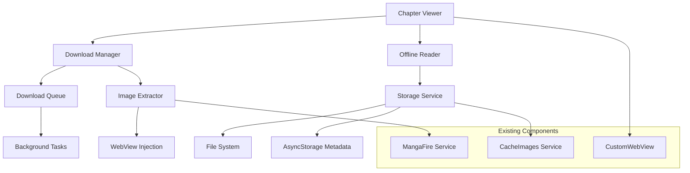

# Design Document: Manga Downloading Feature

## Overview

The manga downloading feature extends MangaNess to support offline reading by downloading and storing manga chapter images locally. The system integrates with the existing WebView-based chapter reading experience, automatically preferring local content when available and seamlessly falling back to network requests for missing content.

The design leverages the existing image caching infrastructure and extends it with dedicated download management, queue processing, and offline-first reading capabilities.

## Architecture

### High-Level Architecture



### Component Integration

The downloading system integrates with existing components:

- **CustomWebView**: Enhanced with download detection and image extraction capabilities
- **CacheImages Service**: Extended to support persistent chapter storage beyond cover caching
- **MangaFire Service**: Provides chapter URL structure and HTML parsing capabilities
- **BookmarkService**: Extended to track download status alongside bookmark data

## Components and Interfaces

### 1. Download Manager (`downloadManager.ts`)

**Responsibilities:**

- Coordinate download operations
- Manage download queue and priorities
- Handle retry logic and error recovery
- Provide download progress tracking

**Key Methods:**

```typescript
interface DownloadManager {
  downloadChapter(
    mangaId: string,
    chapterNumber: string,
    chapterUrl: string
  ): Promise<DownloadResult>;
  getDownloadStatus(
    mangaId: string,
    chapterNumber: string
  ): Promise<DownloadStatus>;
  pauseDownload(downloadId: string): Promise<void>;
  resumeDownload(downloadId: string): Promise<void>;
  cancelDownload(downloadId: string): Promise<void>;
  getActiveDownloads(): Promise<DownloadItem[]>;
}
```

### 2. Image Extractor (`imageExtractor.ts`)

**Responsibilities:**

- Extract image URLs from chapter HTML content
- Handle dynamic image loading detection
- Parse the specific HTML structure from your example
- Integrate with WebView for real-time extraction

**Key Methods:**

```typescript
interface ImageExtractor {
  extractImagesFromHtml(html: string): Promise<ChapterImage[]>;
  extractImagesFromWebView(webView: WebView): Promise<ChapterImage[]>;
  waitForImagesLoaded(webView: WebView): Promise<ChapterImage[]>;
}
```

**HTML Parsing Strategy:**
Based on your HTML example, the extractor will:

1. Parse `<div class="pages longstrip">` container
2. Extract images with `data-number` attributes
3. Handle both loaded (``) and unloaded (``) states
4. Wait for dynamic loading completion

### 3. Storage Service (`chapterStorageService.ts`)

**Responsibilities:**

- Manage local file storage for downloaded chapters
- Handle metadata persistence
- Provide storage space management
- Support offline content retrieval

**Storage Structure:**

```
cache/
├── downloads/
│   ├── manga_[mangaId]/
│   │   ├── chapter_[number]/
│   │   │   ├── page_001.jpg
│   │   │   ├── page_002.jpg
│   │   │   └── metadata.json
│   │   └── chapter_[number]/
│   └── manga_[mangaId]/
└── metadata/
    └── downloads.json
```

**Key Methods:**

```typescript
interface ChapterStorageService {
  saveChapterImages(
    mangaId: string,
    chapterNumber: string,
    images: ChapterImage[]
  ): Promise<void>;
  getChapterImages(
    mangaId: string,
    chapterNumber: string
  ): Promise<ChapterImage[] | null>;
  deleteChapter(mangaId: string, chapterNumber: string): Promise<void>;
  getStorageStats(): Promise<StorageStats>;
  cleanupOldDownloads(): Promise<void>;
}
```

### 4. Offline Reader (`offlineReader.ts`)

**Responsibilities:**

- Provide offline-first reading experience
- Seamlessly blend local and network content
- Handle missing image fallbacks
- Integrate with existing WebView infrastructure

**Key Methods:**

```typescript
interface OfflineReader {
  getChapterContent(
    mangaId: string,
    chapterNumber: string
  ): Promise<ChapterContent>;
  isChapterAvailableOffline(
    mangaId: string,
    chapterNumber: string
  ): Promise<boolean>;
  generateOfflineHtml(images: ChapterImage[]): string;
}

interface ChapterContent {
  isOffline: boolean;
  html: string;
  images: ChapterImage[];
  missingImages: number[];
}
```

### 5. Download Queue (`downloadQueue.ts`)

**Responsibilities:**

- Manage sequential download processing
- Handle background task coordination
- Provide queue persistence across app restarts
- Support priority-based processing

**Key Methods:**

```typescript
interface DownloadQueue {
  addToQueue(item: DownloadQueueItem): Promise<void>;
  processQueue(): Promise<void>;
  pauseQueue(): Promise<void>;
  resumeQueue(): Promise<void>;
  getQueueStatus(): Promise<QueueStatus>;
}
```

## Data Models

### Core Types

```typescript
interface ChapterImage {
  pageNumber: number;
  originalUrl: string;
  localPath?: string;
  downloadStatus: 'pending' | 'downloading' | 'completed' | 'failed';
  fileSize?: number;
}

interface DownloadItem {
  id: string;
  mangaId: string;
  mangaTitle: string;
  chapterNumber: string;
  chapterUrl: string;
  status: DownloadStatus;
  progress: number;
  totalImages: number;
  downloadedImages: number;
  createdAt: number;
  updatedAt: number;
  error?: string;
}

interface DownloadStatus {
  status:
    | 'queued'
    | 'downloading'
    | 'completed'
    | 'failed'
    | 'paused'
    | 'cancelled';
  progress: number;
  estimatedTimeRemaining?: number;
  downloadSpeed?: number;
}

interface StorageStats {
  totalSize: number;
  totalChapters: number;
  mangaCount: number;
  availableSpace: number;
  oldestDownload: number;
}
```

### Extended Manga Types

```typescript
interface MangaDataExtended extends MangaData {
  downloadedChapters: string[];
  downloadStatus: Record<string, DownloadStatus>;
  totalDownloadSize: number;
}

interface ChapterExtended extends Chapter {
  isDownloaded: boolean;
  downloadStatus?: DownloadStatus;
  downloadSize?: number;
}
```

## Error Handling

### Download Error Recovery

1. **Network Errors**: Automatic retry with exponential backoff (max 3 attempts)
2. **Storage Errors**: Cleanup and retry with space management
3. **Parsing Errors**: Fallback to alternative extraction methods
4. **Partial Downloads**: Resume capability with progress tracking

### Error Types

```typescript
enum DownloadErrorType {
  NETWORK_ERROR = 'network_error',
  STORAGE_FULL = 'storage_full',
  PARSING_ERROR = 'parsing_error',
  CANCELLED = 'cancelled',
  UNKNOWN = 'unknown',
}

interface DownloadError {
  type: DownloadErrorType;
  message: string;
  retryable: boolean;
  chapter: string;
  mangaId: string;
}
```

## Testing Strategy

### Unit Testing Focus Areas

1. **Image Extraction Logic**
   - HTML parsing accuracy
   - Dynamic loading detection
   - Error handling for malformed HTML

2. **Storage Operations**
   - File system operations
   - Metadata persistence
   - Space management algorithms

3. **Download Queue Management**
   - Queue ordering and priorities
   - Pause/resume functionality
   - Error recovery mechanisms

### Integration Testing

1. **WebView Integration**
   - Image extraction from live pages
   - Offline content injection
   - Navigation handling

2. **Background Processing**
   - Queue processing during app backgrounding
   - Download continuation across app restarts
   - Memory management during large downloads

### Performance Testing

1. **Download Performance**
   - Concurrent download limits
   - Memory usage during downloads
   - Storage I/O optimization

2. **Offline Reading Performance**
   - Local content loading speed
   - WebView rendering with local images
   - Memory usage with large chapters

## WebView Integration Strategy

### Enhanced CustomWebView

The existing `CustomWebView` component will be enhanced with download capabilities:

1. **Download Detection**: Inject JavaScript to detect when a chapter page is loaded
2. **Image Extraction**: Use the injected script to extract image URLs and loading states
3. **Offline Content**: Modify the injected JavaScript to replace network images with local file URLs
4. **Progress Tracking**: Monitor image loading progress for download status updates

### JavaScript Injection Enhancements

Building on the existing `getInjectedJavaScript` function:

```javascript
// Enhanced injection for download support
const downloadSupportJS = `
  (function() {
    // Existing cleanup functions...
    
    // New download detection
    function detectChapterImages() {
      const pages = document.querySelectorAll('.page');
      const images = [];
      
      pages.forEach(page => {
        const img = page.querySelector('img[data-number]');
        if (img) {
          images.push({
            pageNumber: parseInt(img.dataset.number),
            src: img.src || '',
            loaded: img.classList.contains('loaded')
          });
        }
      });
      
      window.ReactNativeWebView.postMessage(JSON.stringify({
        type: 'CHAPTER_IMAGES_DETECTED',
        images: images
      }));
    }
    
    // Monitor for image loading completion
    function monitorImageLoading() {
      const observer = new MutationObserver(() => {
        detectChapterImages();
      });
      
      observer.observe(document.body, {
        childList: true,
        subtree: true,
        attributes: true,
        attributeFilter: ['class', 'src']
      });
    }
    
    // Initialize download detection
    detectChapterImages();
    monitorImageLoading();
  })();
`;
```

## Performance Considerations

### Download Optimization

1. **Concurrent Limits**: Maximum 3 concurrent image downloads per chapter
2. **Bandwidth Management**: Adaptive download speed based on network conditions
3. **Memory Management**: Stream downloads directly to disk to minimize memory usage
4. **Background Processing**: Utilize React Native background tasks for continued downloads

### Storage Optimization

1. **Image Compression**: Optional JPEG compression for downloaded images
2. **Cleanup Strategies**: LRU-based cleanup when storage limits are reached
3. **Metadata Efficiency**: Minimize metadata overhead with efficient JSON structures
4. **File Organization**: Hierarchical directory structure for fast access

### UI Performance

1. **Progress Updates**: Throttled progress updates to prevent UI blocking
2. **List Virtualization**: Efficient rendering of download lists
3. **Background Updates**: Non-blocking status updates using React state management
4. **Memory Management**: Proper cleanup of download-related resources

## Security Considerations

### File System Security

1. **Path Validation**: Strict validation of file paths to prevent directory traversal
2. **File Type Validation**: Ensure only image files are downloaded and stored
3. **Storage Limits**: Enforce maximum storage limits to prevent disk exhaustion
4. **Cleanup on Uninstall**: Proper cleanup of downloaded content

### Network Security

1. **URL Validation**: Validate image URLs before downloading
2. **HTTPS Enforcement**: Prefer HTTPS URLs when available
3. **Rate Limiting**: Implement rate limiting to avoid overwhelming servers
4. **User Agent**: Consistent user agent usage matching the existing service

## Migration Strategy

### Existing Data Compatibility

1. **Cache Integration**: Leverage existing `CacheImages` service for cover images
2. **Metadata Extension**: Extend existing `MangaData` structure without breaking changes
3. **Storage Separation**: Keep download storage separate from existing cache to avoid conflicts
4. **Gradual Rollout**: Feature flags to enable downloading for specific users or manga

### Backward Compatibility

1. **Optional Feature**: Downloading remains optional, existing functionality unchanged
2. **Graceful Degradation**: App continues to work normally if download features fail
3. **Data Migration**: Automatic migration of existing cache data where applicable
4. **Version Compatibility**: Support for users who don't update immediately
