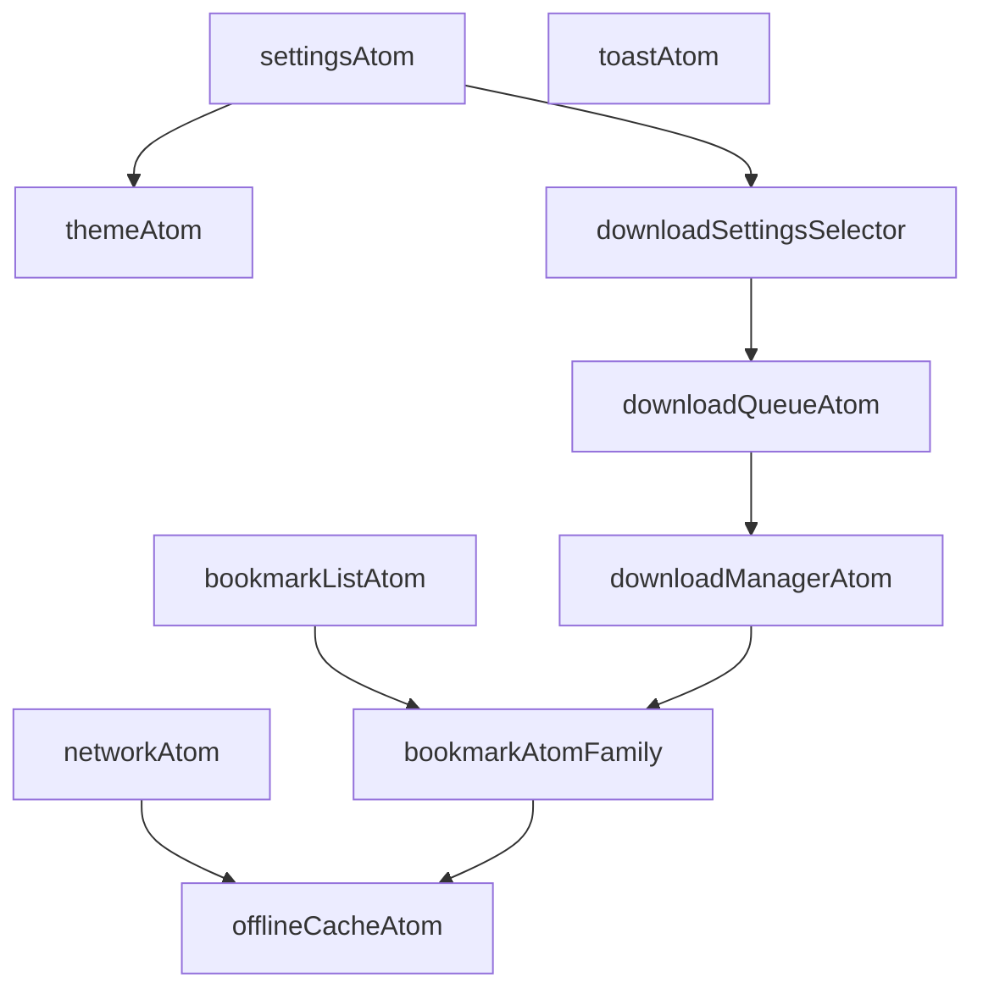

# Design Document: Zedux State Migration

## Overview

This design document outlines the architecture for migrating MangaNess from a decentralized state management approach to a centralized atomic state management system using Zedux. The migration will replace React Context providers, service singletons, and event emitters with Zedux atoms while maintaining all existing functionality, performance characteristics, and AsyncStorage persistence patterns.

### Goals

1. **Centralize State**: Move all application state to Zedux atoms for a single source of truth
2. **Maintain Performance**: Ensure selective re-rendering and efficient state updates
3. **Preserve Persistence**: Keep all AsyncStorage keys and persistence patterns intact
4. **Enable DevTools**: Provide powerful debugging capabilities through Zedux DevTools
5. **Improve Testability**: Make state management easier to test in isolation
6. **Gradual Migration**: Support incremental migration without breaking existing features

### Non-Goals

1. Changing AsyncStorage keys or data structures
2. Modifying existing UI components beyond state access patterns
3. Altering business logic or feature behavior
4. Replacing Reanimated animations
5. Changing the file-based routing structure

## Architecture

### Zedux Ecosystem Setup

The Zedux ecosystem will be initialized at the root level of the application, wrapping all providers and the navigation tree. This provides a single store for all atoms and enables dependency injection.

```typescript
// app/_layout.tsx (simplified)
import { createEcosystem, EcosystemProvider } from '@zedux/react'
import { isDebugEnabled } from '@/constants/env'

const ecosystem = createEcosystem({
  id: 'manganess',
  enableDevTools: isDebugEnabled(),
})

export default function RootLayout() {
  return (
    <GestureHandlerRootView style={{ flex: 1 }}>
      <EcosystemProvider ecosystem={ecosystem}>
        {/* All app content */}
      </EcosystemProvider>
    </GestureHandlerRootView>
  )
}
```

### Atom Architecture Patterns

#### 1. Persisted Atoms

Atoms that need to persist to AsyncStorage will use a custom persistence plugin:

```typescript
// atoms/plugins/asyncStoragePlugin.ts
import AsyncStorage from '@react-native-async-storage/async-storage';
import { AtomInstance } from '@zedux/react';
import { logger } from '@/utils/logger';

interface PersistenceConfig {
  key: string;
  debounceMs?: number;
  serialize?: (value: any) => string;
  deserialize?: (value: string) => any;
}

export const asyncStoragePlugin = (config: PersistenceConfig) => {
  const {
    key,
    debounceMs = 300,
    serialize = JSON.stringify,
    deserialize = JSON.parse,
  } = config;
  let timeoutId: NodeJS.Timeout | null = null;

  return (instance: AtomInstance) => {
    // Load initial state from AsyncStorage
    const loadInitialState = async () => {
      try {
        const stored = await AsyncStorage.getItem(key);
        if (stored) {
          const parsed = deserialize(stored);
          instance.setState(parsed);
        }
      } catch (error) {
        logger().error('Storage', 'Failed to load persisted state', {
          key,
          error,
        });
      }
    };

    // Persist state changes with debouncing
    const persistState = (state: any) => {
      if (timeoutId) clearTimeout(timeoutId);

      timeoutId = setTimeout(async () => {
        try {
          await AsyncStorage.setItem(key, serialize(state));
        } catch (error) {
          logger().error('Storage', 'Failed to persist state', { key, error });
        }
      }, debounceMs);
    };

    // Load initial state
    loadInitialState();

    // Subscribe to state changes
    const cleanup = instance.on('state', ({ newState }) => {
      persistState(newState);
    });

    return cleanup;
  };
};
```

#### 2. Reactive Atoms

Atoms that need to react to external events (like NetInfo) will use effects:

```typescript
// atoms/networkAtom.ts
import { atom } from '@zedux/react';
import NetInfo from '@react-native-community/netinfo';

export const networkAtom = atom('network', () => {
  const store = injectStore({
    isOffline: false,
    isConnected: true,
    type: 'unknown',
  });

  injectEffect(() => {
    const unsubscribe = NetInfo.addEventListener((state) => {
      store.setState({
        isOffline: !state.isConnected || state.isInternetReachable === false,
        isConnected: state.isConnected ?? false,
        type: state.type,
      });
    });

    return unsubscribe;
  }, []);

  return store;
});
```

#### 3. Atom Families

For state that varies by ID (like manga bookmarks), we'll use atom families:

```typescript
// atoms/bookmarkAtom.ts
import { atomFamily } from '@zedux/react';
import { MangaData } from '@/types';

export const bookmarkAtomFamily = atomFamily('bookmark', (mangaId: string) => {
  const store = injectStore<MangaData | null>(null);

  // Use persistence plugin
  injectAtomInstance(
    asyncStoragePlugin({
      key: `manga_${mangaId}`,
    })
  );

  return store;
});
```

#### 4. Derived State (Selectors)

For computed values, we'll use atom selectors:

```typescript
// atoms/selectors/bookmarkSelectors.ts
import { atomSelector } from '@zedux/react';
import { bookmarkListAtom } from '../bookmarkListAtom';

export const bookmarkCountSelector = atomSelector(
  'bookmarkCount',
  ({ get }) => {
    const bookmarks = get(bookmarkListAtom);
    return bookmarks.length;
  }
);

export const readingMangaSelector = atomSelector('readingManga', ({ get }) => {
  const bookmarks = get(bookmarkListAtom);
  return bookmarks.filter((b) => b.bookmarkStatus === 'Reading');
});
```

## Components and Interfaces

### Core Atoms

#### 1. Theme Atom

**Purpose**: Manages theme settings (light/dark/system) and accent color

**State Shape**:

```typescript
interface ThemeState {
  theme: 'light' | 'dark' | 'system';
  accentColor: string | undefined;
  systemTheme: 'light' | 'dark';
  actualTheme: 'light' | 'dark';
}
```

**Key Features**:

- Persists to AsyncStorage key `app_settings` (nested in settings)
- Reacts to system theme changes via `useColorScheme`
- Provides computed `actualTheme` based on theme setting and system theme
- Updates Colors object when accent color changes

**API**:

```typescript
const useTheme = () => useAtomValue(themeAtom)
const setTheme = (theme: ThemeType) => useAtomInstance(themeAtom).setState(...)
const setAccentColor = (color: string | undefined) => ...
```

#### 2. Network Atom

**Purpose**: Manages network connectivity status with debouncing

**State Shape**:

```typescript
interface NetworkState {
  isOffline: boolean;
  isConnected: boolean;
  networkType: string;
  isInternetReachable: boolean | null;
  showOfflineIndicator: boolean;
}
```

**Key Features**:

- Subscribes to NetInfo for network status updates
- Debounces offline status (5 seconds before marking offline)
- Debounces online indicator hiding (2 seconds after coming online)
- No persistence (ephemeral state)

**API**:

```typescript
const useOffline = () => useAtomValue(networkAtom);
```

#### 3. Toast Atom

**Purpose**: Manages toast notification display and auto-hide

**State Shape**:

```typescript
interface ToastState {
  config: ToastConfig | null;
  isVisible: boolean;
}

interface ToastConfig {
  message: string;
  icon?: IconName;
  duration?: number;
  type?: 'success' | 'info' | 'warning' | 'error';
}
```

**Key Features**:

- Auto-hides toast after specified duration
- Replaces current toast when new one is triggered
- Integrates with Reanimated for animations
- No persistence (ephemeral state)

**API**:

```typescript
const showToast = (config: ToastConfig) =>
  getInstance(toastAtom).exports.showToast(config);
const useToastState = () => useAtomValue(toastAtom);
```

#### 4. Bookmark List Atom

**Purpose**: Manages the list of all bookmarked manga

**State Shape**:

```typescript
interface BookmarkListState {
  bookmarks: MangaData[];
  bookmarkKeys: string[];
  lastUpdated: number;
}
```

**Key Features**:

- Loads all bookmarks from AsyncStorage on initialization
- Maintains bookmarkKeys array for backwards compatibility
- Sets bookmarkChanged flag on any update
- Triggers offline cache for bookmarked manga

**API**:

```typescript
const useBookmarks = () => useAtomValue(bookmarkListAtom);
const addBookmark = (manga: MangaData) =>
  getInstance(bookmarkListAtom).exports.addBookmark(manga);
const removeBookmark = (mangaId: string) =>
  getInstance(bookmarkListAtom).exports.removeBookmark(mangaId);
```

#### 5. Bookmark Atom Family

**Purpose**: Manages individual manga bookmark data

**State Shape**:

```typescript
type BookmarkState = MangaData | null;
```

**Key Features**:

- Persists to AsyncStorage key `manga_${id}`
- Parameterized by manga ID
- Provides read chapters, bookmark status, download info
- Updates parent bookmark list atom on changes

**API**:

```typescript
const useMangaData = (mangaId: string) => useAtomValue(bookmarkAtomFamily(mangaId))
const updateMangaData = (mangaId: string, data: Partial<MangaData>) => ...
```

#### 6. Settings Atom

**Purpose**: Manages app-wide settings

**State Shape**:

```typescript
interface SettingsState {
  theme: 'light' | 'dark' | 'system';
  enableDebugTab: boolean;
  onboardingCompleted: boolean;
  accentColor?: string;
  defaultLayout: 'grid' | 'list';
  downloadSettings: DownloadSettings;
}
```

**Key Features**:

- Persists to AsyncStorage key `app_settings`
- Provides default values for missing settings
- Migrates legacy settings (searchLayout → defaultLayout)
- Nested download settings with defaults

**API**:

```typescript
const useSettings = () => useAtomValue(settingsAtom)
const updateSettings = (updates: Partial<SettingsState>) => ...
const useDownloadSettings = () => useAtomValue(downloadSettingsSelector)
```

#### 7. Download Manager Atom

**Purpose**: Manages active downloads and their progress

**State Shape**:

```typescript
interface DownloadManagerState {
  activeDownloads: Map<string, DownloadProgress>;
  pausedDownloads: Map<string, PausedDownloadInfo>;
  downloadContexts: Map<string, DownloadContext>;
}

interface DownloadProgress {
  downloadId: string;
  mangaId: string;
  mangaTitle: string;
  chapterNumber: string;
  totalImages: number;
  downloadedImages: number;
  failedImages: number;
  progress: number;
  startTime: number;
  lastUpdateTime: number;
  estimatedTimeRemaining?: number;
  downloadSpeed?: number;
  totalBytes: number;
  downloadedBytes: number;
}
```

**Key Features**:

- Tracks active download progress
- Persists paused downloads to AsyncStorage for resume
- Reacts to app state changes (pause on background, resume on foreground)
- Integrates with download queue atom
- Replaces downloadEventEmitter with atom subscriptions

**API**:

```typescript
const useDownloadProgress = (downloadId: string) => useAtomValue(downloadProgressSelector(downloadId))
const startDownload = (context: DownloadContext) => getInstance(downloadManagerAtom).exports.startDownload(context)
const pauseDownload = (downloadId: string) => ...
const resumeDownload = (downloadId: string) => ...
```

#### 8. Download Queue Atom

**Purpose**: Manages the download queue and concurrent download limits

**State Shape**:

```typescript
interface DownloadQueueState {
  queue: DownloadQueueItem[];
  activeDownloadIds: Set<string>;
  isPaused: boolean;
  isProcessing: boolean;
}
```

**Key Features**:

- Respects max concurrent downloads setting from settings atom
- Automatically starts next download when one completes
- Persists queue to AsyncStorage
- Coordinates with download manager atom

**API**:

```typescript
const useQueueStatus = () => useAtomValue(queueStatusSelector);
const queueDownload = (item: DownloadQueueItem) =>
  getInstance(downloadQueueAtom).exports.queueDownload(item);
const clearQueue = () => getInstance(downloadQueueAtom).exports.clearQueue();
```

#### 9. Offline Cache Atom

**Purpose**: Manages offline cache for manga details, search results, and home data

**State Shape**:

```typescript
interface OfflineCacheState {
  mangaDetailsCache: Map<string, CachedMangaDetails>;
  searchCache: Map<string, CachedSearchResults>;
  homeCache: CachedHomeData | null;
}

interface CachedData<T> {
  data: T;
  timestamp: number;
  expiresAt: number;
}
```

**Key Features**:

- Persists to AsyncStorage with keys:
  - `offline_manga_details_cache`
  - `offline_search_cache_${query}`
  - `offline_home_cache`
- Implements stale-while-revalidate pattern
- Automatically expires old cache entries
- Integrates with network atom for offline detection

**API**:

```typescript
const useCachedMangaDetails = (mangaId: string) => useAtomValue(cachedMangaDetailsSelector(mangaId))
const cacheMangaDetails = (mangaId: string, details: MangaDetails) => ...
const getCachedSearchResults = (query: string) => ...
```

### Atom Dependency Graph



## Data Models

### Atom State Types

All atom state types will be defined in `types/atoms.ts`:

```typescript
// Theme
export interface ThemeAtomState {
  theme: ThemeType;
  accentColor: string | undefined;
  systemTheme: ColorScheme;
  actualTheme: 'light' | 'dark';
}

// Network
export interface NetworkAtomState {
  isOffline: boolean;
  isConnected: boolean;
  networkType: string;
  isInternetReachable: boolean | null;
  showOfflineIndicator: boolean;
}

// Toast
export interface ToastAtomState {
  config: ToastConfig | null;
  isVisible: boolean;
}

// Bookmarks
export interface BookmarkListAtomState {
  bookmarks: MangaData[];
  bookmarkKeys: string[];
  lastUpdated: number;
}

// Settings
export interface SettingsAtomState {
  theme: ThemeType;
  enableDebugTab: boolean;
  onboardingCompleted: boolean;
  accentColor?: string;
  defaultLayout: 'grid' | 'list';
  downloadSettings: DownloadSettings;
}

// Downloads
export interface DownloadManagerAtomState {
  activeDownloads: Map<string, DownloadProgress>;
  pausedDownloads: Map<string, PausedDownloadInfo>;
  downloadContexts: Map<string, DownloadContext>;
}

export interface DownloadQueueAtomState {
  queue: DownloadQueueItem[];
  activeDownloadIds: Set<string>;
  isPaused: boolean;
  isProcessing: boolean;
}

// Offline Cache
export interface OfflineCacheAtomState {
  mangaDetailsCache: Map<string, CachedMangaDetails>;
  searchCache: Map<string, CachedSearchResults>;
  homeCache: CachedHomeData | null;
}
```

### Persistence Keys

All AsyncStorage keys will remain unchanged:

- `app_settings` - Settings atom
- `manga_${id}` - Individual bookmark data (atom family)
- `bookmarkKeys` - List of bookmark keys (maintained for backwards compatibility)
- `offline_manga_details_cache` - Cached manga details
- `offline_search_cache_${query}` - Cached search results
- `offline_home_cache` - Cached home data
- `download_manager_paused_contexts` - Paused download contexts
- `recently_read_${id}` - Recently read manga (maintained by existing service)

## Correctness Properties

_A property is a characteristic or behavior that should hold true across all valid executions of a system—essentially, a formal statement about what the system should do. Properties serve as the bridge between human-readable specifications and machine-verifiable correctness guarantees._

### Property 1: Ecosystem Initialization

_For any_ app initialization, the Zedux ecosystem should be created and available before any atoms are accessed.

**Validates: Requirements 1.2**

### Property 2: Theme Persistence Round Trip

_For any_ theme setting change (theme or accent color), the new value should be persisted to AsyncStorage and retrievable on next app launch.

**Validates: Requirements 2.2, 2.4**

### Property 3: System Theme Reactivity

_For any_ system theme change when user theme is set to 'system', the actualTheme should update to match the system theme.

**Validates: Requirements 2.3**

### Property 4: Selective Re-rendering

_For any_ atom state update, only components that consume that specific atom should re-render, not unrelated components.

**Validates: Requirements 2.6, 10.4, 14.1**

### Property 5: Network Status Debouncing

_For any_ network connectivity change, the offline status should update after the appropriate debounce period (5 seconds for offline, immediate for online with 2 second indicator delay).

**Validates: Requirements 3.2, 3.3, 3.4**

### Property 6: Single NetInfo Subscription

_For any_ number of components using network status, only one NetInfo subscription should exist in the system.

**Validates: Requirements 3.5**

### Property 7: Toast Auto-Hide

_For any_ toast with a specified duration, the toast should automatically hide after that duration elapses.

**Validates: Requirements 4.2**

### Property 8: Toast Replacement

_For any_ new toast triggered while one is visible, the new toast should replace the current toast immediately.

**Validates: Requirements 4.3**

### Property 9: Toast Cleanup

_For any_ toast that is hidden, the toast configuration should be cleared (set to null).

**Validates: Requirements 4.4**

### Property 10: Bookmark Persistence

_For any_ bookmark addition or removal, the change should be persisted to AsyncStorage with the correct key (`manga_${id}`) and the bookmarkKeys array should be updated.

**Validates: Requirements 5.2, 5.3, 5.5**

### Property 11: Read Chapters Update

_For any_ chapter marked as read, the readChapters array should be updated and persisted to AsyncStorage.

**Validates: Requirements 5.4**

### Property 12: Bookmark Change Flag

_For any_ bookmark data change, the bookmarkChanged flag should be set in AsyncStorage.

**Validates: Requirements 5.6**

### Property 13: Offline Cache Trigger

_For any_ manga bookmarked, the offline cache service should be triggered to cache the manga details.

**Validates: Requirements 5.7**

### Property 14: Settings Persistence

_For any_ settings change, the new value should be persisted to AsyncStorage immediately and retrievable on next access.

**Validates: Requirements 6.2**

### Property 15: Settings Defaults

_For any_ missing setting field, a default value should be provided when settings are loaded.

**Validates: Requirements 6.3, 6.4**

### Property 16: Download Progress Tracking

_For any_ download in progress, the progress entry should be updated with current downloaded images count and progress percentage.

**Validates: Requirements 7.2**

### Property 17: Download Completion

_For any_ completed download, it should be marked as complete and added to the manga's downloadedChapters array.

**Validates: Requirements 7.3**

### Property 18: Download Error Handling

_For any_ download failure, the error should be stored and the download should be marked as failed or paused based on the error type (network errors → paused, other errors → failed).

**Validates: Requirements 7.4**

### Property 19: Download Pause Persistence

_For any_ paused download, the download context should be persisted to AsyncStorage for resume capability.

**Validates: Requirements 7.5**

### Property 20: Download Restoration

_For any_ app restart, paused downloads should be restored from AsyncStorage and available for resumption.

**Validates: Requirements 7.6**

### Property 21: App State Download Management

_For any_ app state change to background, all active downloads should pause; for any app state change to foreground, downloads paused due to app state should resume.

**Validates: Requirements 7.7, 7.8**

### Property 22: Queue Concurrent Limit

_For any_ queue processing, the number of active downloads should never exceed the max concurrent downloads setting.

**Validates: Requirements 8.2**

### Property 23: Queue Auto-Start

_For any_ completed download, if there are queued downloads and capacity allows, the next download should start automatically.

**Validates: Requirements 8.3**

### Property 24: Queue Retry Logic

_For any_ failed download, the queue should update its status and apply retry logic based on the error type.

**Validates: Requirements 8.4**

### Property 25: Cache Key Consistency

_For any_ cached data (manga details, search results, home data), it should be stored with the correct AsyncStorage key format.

**Validates: Requirements 9.1, 9.2**

### Property 26: Cache Expiration

_For any_ cached data access, expired data should not be returned (return null instead).

**Validates: Requirements 9.4**

### Property 27: Stale-While-Revalidate

_For any_ cache access when online, stale data should be returned immediately while fresh data is fetched in the background.

**Validates: Requirements 9.5**

### Property 28: Atom Cleanup

_For any_ component unmount, if the atom instance is no longer needed by any component, it should be cleaned up to prevent memory leaks.

**Validates: Requirements 10.5**

### Property 29: Event System Replacement

_For any_ download state change, components subscribed to the download atom should update, maintaining the same behavior as the event emitter system.

**Validates: Requirements 11.2, 11.3, 11.4**

### Property 30: Update Batching

_For any_ multiple state updates occurring in quick succession, they should be batched to minimize re-renders.

**Validates: Requirements 11.5, 14.4**

### Property 31: AsyncStorage Persistence

_For any_ persisted atom, initial state should load from AsyncStorage on atom creation.

**Validates: Requirements 12.1**

### Property 32: Debounced Persistence

_For any_ persisted atom state change, writes to AsyncStorage should be debounced to avoid excessive I/O operations.

**Validates: Requirements 12.2**

### Property 33: Storage Error Resilience

_For any_ AsyncStorage operation failure, the system should log the error and continue with in-memory state without crashing.

**Validates: Requirements 12.3, 18.1**

### Property 34: Non-Blocking Initialization

_For any_ app initialization, AsyncStorage loading should occur asynchronously without blocking the initial render.

**Validates: Requirements 12.4**

### Property 35: Batch Storage Writes

_For any_ multiple atoms persisting to AsyncStorage simultaneously, writes should be batched when possible to improve performance.

**Validates: Requirements 12.5**

### Property 36: API Compatibility

_For any_ migrated atom, the API surface for consuming components should remain the same as the previous implementation.

**Validates: Requirements 13.2**

### Property 37: Storage Key Consistency

_For any_ AsyncStorage access, the keys should match the current implementation exactly.

**Validates: Requirements 13.3**

### Property 38: Update Semantics Preservation

_For any_ state update, the update semantics (timing, side effects, derived state) should match the current implementation.

**Validates: Requirements 13.4**

### Property 39: Async Storage Non-Blocking

_For any_ AsyncStorage operation, it should be performed asynchronously without blocking the UI thread.

**Validates: Requirements 14.3**

### Property 40: Critical State Priority

_For any_ app initialization, critical state (theme, settings) should load before non-critical state (cache, download history).

**Validates: Requirements 14.5**

### Property 41: Initialization Fallback

_For any_ atom initialization failure, default values should be provided to prevent the app from crashing.

**Validates: Requirements 18.2**

### Property 42: Update Failure Reversion

_For any_ atom update failure, the state should revert to the previous value and the user should be notified via toast.

**Validates: Requirements 18.3**

### Property 43: Network Error State

_For any_ network request failure, the atom state should be updated to reflect the error (e.g., error field set).

**Validates: Requirements 18.4**

### Property 44: Error Logging Integration

_For any_ error in atom operations, it should be logged using the existing logger utility with appropriate scope and context.

**Validates: Requirements 18.5**

### Property 45: Reanimated Shared Value Sync

_For any_ atom update that drives animations, there should be a mechanism to sync the atom value with Reanimated shared values.

**Validates: Requirements 19.5**

## Error Handling

### AsyncStorage Errors

All AsyncStorage operations will be wrapped in try-catch blocks with error logging:

```typescript
try {
  await AsyncStorage.setItem(key, value);
} catch (error) {
  logger().error('Storage', 'Failed to persist state', { key, error });
  // Continue with in-memory state
}
```

### Atom Initialization Errors

Atoms will provide default values if initialization fails:

```typescript
const loadInitialState = async () => {
  try {
    const stored = await AsyncStorage.getItem(key);
    return stored ? JSON.parse(stored) : defaultValue;
  } catch (error) {
    logger().error('Storage', 'Failed to load initial state', { key, error });
    return defaultValue;
  }
};
```

### Network Errors

Network errors in download operations will be handled by pausing downloads:

```typescript
if (error.type === DownloadErrorType.NETWORK_ERROR) {
  // Pause download for later resume
  pauseDownload(downloadId, 'error');
} else {
  // Mark as failed
  failDownload(downloadId, error.message);
}
```

### User Notification

Critical errors will be communicated to users via toast notifications:

```typescript
showToast({
  message: 'Failed to save bookmark. Please try again.',
  type: 'error',
  duration: 3000,
});
```

## Testing Strategy

### Dual Testing Approach

The migration will use both unit tests and property-based tests for comprehensive coverage:

**Unit Tests**: Focus on specific examples, edge cases, and integration points

- Specific theme changes (light → dark, system theme detection)
- Toast display and auto-hide timing
- Bookmark CRUD operations
- Download state transitions
- Error handling scenarios

**Property-Based Tests**: Verify universal properties across all inputs

- Theme persistence round-trip for any theme value
- Selective re-rendering for any atom update
- Network debouncing for any connectivity change
- Download queue respecting concurrent limits for any queue size
- Cache expiration for any timestamp

### Property-Based Testing Configuration

We'll use `fast-check` for property-based testing in TypeScript:

```bash
bun add -D fast-check @testing-library/react-native
```

Each property test will:

- Run minimum 100 iterations
- Reference the design document property
- Use the tag format: `Feature: zedux-state-migration, Property {number}: {property_text}`

Example property test:

```typescript
import fc from 'fast-check';
import { renderHook } from '@testing-library/react-native';
import { createTestEcosystem } from '@/atoms/testUtils';

// Feature: zedux-state-migration, Property 2: Theme Persistence Round Trip
describe('Theme Persistence', () => {
  it('should persist and restore any theme value', async () => {
    await fc.assert(
      fc.asyncProperty(
        fc.oneof(
          fc.constant('light'),
          fc.constant('dark'),
          fc.constant('system')
        ),
        async (theme) => {
          const ecosystem = createTestEcosystem();
          const { result } = renderHook(() => useTheme(), {
            wrapper: ecosystem,
          });

          // Set theme
          act(() => result.current.setTheme(theme));

          // Wait for persistence
          await new Promise((resolve) => setTimeout(resolve, 400));

          // Create new ecosystem (simulating app restart)
          const newEcosystem = createTestEcosystem();
          const { result: newResult } = renderHook(() => useTheme(), {
            wrapper: newEcosystem,
          });

          // Theme should be restored
          expect(newResult.current.theme).toBe(theme);
        }
      ),
      { numRuns: 100 }
    );
  });
});
```

### Unit Test Examples

```typescript
// Specific example: Toast auto-hide
it('should hide toast after 2500ms by default', async () => {
  const { result } = renderHook(() => useToast());

  act(() => result.current.showToast({ message: 'Test' }));

  expect(result.current.isVisible).toBe(true);

  await waitFor(() => expect(result.current.isVisible).toBe(false), {
    timeout: 3000,
  });
});

// Edge case: Empty bookmark list
it('should handle empty bookmark list', () => {
  const { result } = renderHook(() => useBookmarks());

  expect(result.current.bookmarks).toEqual([]);
  expect(result.current.bookmarkKeys).toEqual([]);
});
```

### Test Utilities

We'll create test utilities for Zedux atoms:

```typescript
// atoms/testUtils.ts
import { createEcosystem } from '@zedux/react';
import AsyncStorage from '@react-native-async-storage/async-storage';

export const createTestEcosystem = () => {
  return createEcosystem({
    id: 'test',
    enableDevTools: false,
  });
};

export const clearTestStorage = async () => {
  await AsyncStorage.clear();
};

export const mockAsyncStorage = (data: Record<string, string>) => {
  AsyncStorage.getItem = jest.fn((key) => Promise.resolve(data[key] || null));
  AsyncStorage.setItem = jest.fn();
  AsyncStorage.removeItem = jest.fn();
};
```

## Migration Strategy

### Phase 1: Foundation (Week 1)

**Goal**: Set up Zedux infrastructure and create core utilities

1. Install Zedux and configure ecosystem
2. Create AsyncStorage persistence plugin
3. Create test utilities and ecosystem setup
4. Set up DevTools integration
5. Create type definitions for all atom states

**Deliverables**:

- Zedux ecosystem initialized in `app/_layout.tsx`
- `atoms/plugins/asyncStoragePlugin.ts` implemented
- `atoms/testUtils.ts` with test helpers
- `types/atoms.ts` with all state type definitions

### Phase 2: Simple Atoms (Week 2)

**Goal**: Migrate standalone atoms without complex dependencies

1. Migrate Toast atom (no persistence, simple state)
2. Migrate Network atom (external subscription, no persistence)
3. Migrate Settings atom (simple persistence)
4. Create custom hooks for each atom

**Deliverables**:

- `atoms/toastAtom.ts` with showToast export
- `atoms/networkAtom.ts` with NetInfo integration
- `atoms/settingsAtom.ts` with persistence
- `hooks/useToast.ts`, `hooks/useOffline.ts`, `hooks/useSettings.ts`
- Unit and property tests for each atom

**Migration Approach**: Keep old Context providers alongside new atoms, gradually switch components to use new hooks

### Phase 3: Theme System (Week 3)

**Goal**: Migrate theme management with system theme reactivity

1. Create Theme atom with system theme subscription
2. Integrate with Colors object for accent color updates
3. Migrate all components from ThemeContext to useTheme hook
4. Remove ThemeContext provider

**Deliverables**:

- `atoms/themeAtom.ts` with full theme logic
- `hooks/useTheme.ts` matching old API
- All components migrated to new hook
- ThemeContext removed

### Phase 4: Bookmark System (Week 4)

**Goal**: Migrate bookmark management with atom family

1. Create Bookmark List atom
2. Create Bookmark atom family for individual manga
3. Create bookmark selectors (reading manga, bookmark count, etc.)
4. Migrate bookmarkService functions to atom exports
5. Update all components using bookmarks

**Deliverables**:

- `atoms/bookmarkListAtom.ts`
- `atoms/bookmarkAtomFamily.ts`
- `atoms/selectors/bookmarkSelectors.ts`
- `hooks/useBookmarks.ts`, `hooks/useMangaData.ts`
- bookmarkService deprecated

### Phase 5: Download System (Week 5-6)

**Goal**: Migrate complex download management system

1. Create Download Manager atom with app state integration
2. Create Download Queue atom
3. Replace downloadEventEmitter with atom subscriptions
4. Migrate download-related components
5. Update batch download orchestrator to use atoms

**Deliverables**:

- `atoms/downloadManagerAtom.ts`
- `atoms/downloadQueueAtom.ts`
- `atoms/selectors/downloadSelectors.ts`
- `hooks/useDownloadProgress.ts`, `hooks/useDownloadQueue.ts`
- downloadEventEmitter removed
- All download components migrated

### Phase 6: Offline Cache (Week 7)

**Goal**: Migrate offline caching system

1. Create Offline Cache atom with stale-while-revalidate
2. Create cache selectors for manga details, search, home
3. Integrate with network atom for offline detection
4. Migrate offlineCacheService to atom exports
5. Update components using cached data

**Deliverables**:

- `atoms/offlineCacheAtom.ts`
- `atoms/selectors/cacheSelectors.ts`
- `hooks/useCachedData.ts`
- offlineCacheService deprecated

### Phase 7: Cleanup and Optimization (Week 8)

**Goal**: Remove old code and optimize performance

1. Remove all deprecated Context providers
2. Remove deprecated service singletons
3. Remove downloadEventEmitter
4. Optimize atom dependencies and selectors
5. Add comprehensive documentation
6. Performance testing and optimization

**Deliverables**:

- All old state management code removed
- Performance benchmarks showing no regression
- Complete documentation in `docs/state-management.md`
- Migration guide for future features

### Rollback Strategy

Each phase will maintain backwards compatibility:

1. **Dual Implementation**: Keep old and new systems running in parallel
2. **Feature Flags**: Use environment variable to toggle between old/new (if needed)
3. **Gradual Component Migration**: Migrate components one at a time
4. **Comprehensive Testing**: Test each migrated component thoroughly
5. **Easy Revert**: Can revert individual components to old implementation if issues arise

### Success Criteria

The migration is complete when:

1. ✅ All Context providers removed
2. ✅ All service singletons deprecated or removed
3. ✅ downloadEventEmitter removed
4. ✅ All components using Zedux atoms
5. ✅ All tests passing (unit and property tests)
6. ✅ No performance regression (measured via performance monitor)
7. ✅ DevTools working in development mode
8. ✅ Documentation complete

## Integration with Existing Systems

### Reanimated Integration

For components using Reanimated, we'll create a utility to sync atoms with shared values:

```typescript
// utils/reanimatedSync.ts
import { useEffect } from 'react';
import { useSharedValue } from 'react-native-reanimated';
import { useAtomValue } from '@zedux/react';

export const useSyncAtomToSharedValue = <T>(
  atom: any,
  selector?: (state: any) => T
) => {
  const value = useAtomValue(atom);
  const sharedValue = useSharedValue(selector ? selector(value) : value);

  useEffect(() => {
    sharedValue.value = selector ? selector(value) : value;
  }, [value, sharedValue, selector]);

  return sharedValue;
};
```

Usage in components:

```typescript
const toastState = useAtomValue(toastAtom);
const translateY = useSyncAtomToSharedValue(toastAtom, (state) =>
  state.isVisible ? 0 : 100
);
```

### Logger Integration

All atom operations will integrate with the existing logger:

```typescript
// In atom implementations
import { logger } from '@/utils/logger';

const log = logger();

// Log state changes in development
if (isDebugEnabled()) {
  log.info('State', 'Atom updated', { atom: 'themeAtom', newState });
}

// Log errors
log.error('State', 'Failed to persist atom', { atom: 'settingsAtom', error });
```

### Performance Monitor Integration

Atom updates will be tracked by the performance monitor:

```typescript
// In critical atoms
import { performanceMonitor } from '@/utils/performance';

const updateState = async (newState: any) => {
  const measure = performanceMonitor.startMeasure('atom-update', {
    atom: 'bookmarkListAtom',
  });

  try {
    await persistState(newState);
    store.setState(newState);
  } finally {
    measure.end();
  }
};
```
